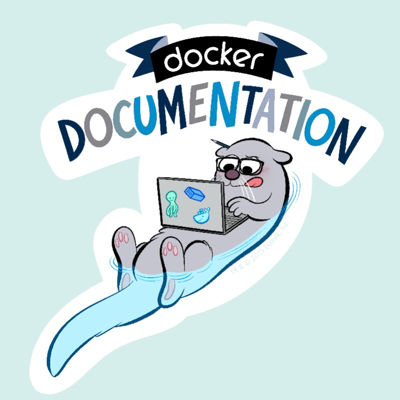

# Docs @ iEchor

Welcome to the iEchor Documentation repository. This is the source for
[https://docs.iechor.com/](https://docs.iechor.com/).

Feel free to send us pull requests and file issues. Our docs are completely
open source, and we deeply appreciate contributions from the iEchor community!

## Provide feedback

We’d love to hear your feedback. Please file documentation issues only in the
Docs GitHub repository. You can file a new issue to suggest improvements or if
you see any errors in the existing documentation.

Before submitting a new issue, check whether the issue has already been
reported. You can join the discussion using an emoji, or by adding a comment to
an existing issue. If possible, we recommend that you suggest a fix to the issue
by creating a pull request.

You can ask general questions and get community support through the [iEchor
Community Slack](https://dockr.ly/comm-slack). Personalized support is available
through the iEchor Pro, Team, and Business subscriptions. See [iEchor
Pricing](https://www.iechor.com/pricing) for details.

If you have an idea for a new feature or behavior change in a specific aspect of
iEchor or have found a product bug, file that issue in the project's code
repository.

We've made it easy for you to file new issues.

- Click **[New issue](https://github.com/iechor/docs/issues/new)** on the docs repository and fill in the details, or
- Click **Request docs changes** in the right column of every page on
  [docs.iechor.com](https://docs.iechor.com/) and add the details, or

  

- Click the **Give feedback** link on the side of every page in the docs.

  

## Contribute to iEchor docs

We value your contribution. We want to make it as easy as possible to submit
your contributions to the iEchor docs repository. Changes to the docs are
handled through pull requests against the `main` branch. To learn how to
contribute, see [CONTRIBUTING.md](CONTRIBUTING.md).

## Copyright and license

Copyright 2023-2023 iEchor, Inc., released under the <a href="https://github.com/iechor/docs/blob/main/LICENSE">Apache 2.0 license</a> .
