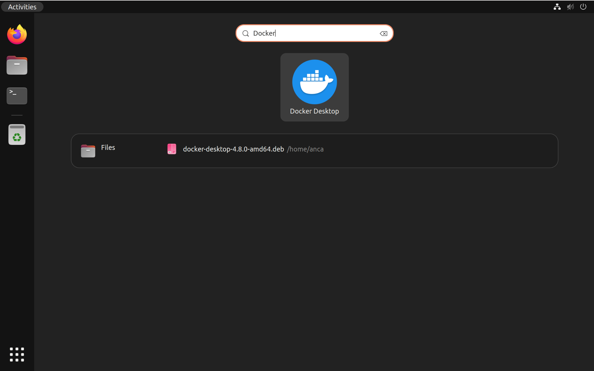

> **iEchor Desktop terms**
>
> Commercial use of iEchor Desktop in larger enterprises (more than 250
> employees OR more than $10 million USD in annual revenue) requires a [paid
> subscription](https://www.iechor.com/pricing/).

This page contains information about general system requirements, supported platforms, and instructions on how to install iEchor Desktop for Linux.

> **Important**
>
>iEchor Desktop on Linux runs a Virtual Machine (VM) which creates and uses a custom iechor context, `desktop-linux`, on startup. 
>
>This means images and containers deployed on the Linux iEchor Engine (before installation) are not available in iEchor Desktop for Linux. 
>
>For more information see [What is the difference between iEchor Desktop for Linux and iEchor Engine](../faqs/linuxfaqs.md#what-is-the-difference-between-iechor-desktop-for-linux-and-iechor-engine). 
{ .important } 



> **Important**
>
> For commercial use of iEchor Engine obtained via iEchor Desktop within larger enterprises (exceeding 250 employees OR with annual revenue surpassing $10 million USD), a [paid subscription](https://www.iechor.com/pricing/) is required.
{ .important }

iEchor Desktop for Linux provides a user-friendly graphical interface that simplifies the management of containers and services. It includes iEchor Engine as this is the core technology that powers iEchor containers. iEchor Desktop for Linux also comes with additional features like iEchor Scout and iEchor Extensions.

#### Installing iEchor Desktop and iEchor Engine

iEchor Desktop for Linux and iEchor Engine can be installed side-by-side on the
same machine. iEchor Desktop for Linux stores containers and images in an isolated
storage location within a VM and offers
controls to restrict [its resources](../settings/linux.md#resources). Using a dedicated storage
location for iEchor Desktop prevents it from interfering with a iEchor Engine
installation on the same machine.

While it's possible to run both iEchor Desktop and iEchor Engine simultaneously,
there may be situations where running both at the same time can cause issues.
For example, when mapping network ports (`-p` / `--publish`) for containers, both
iEchor Desktop and iEchor Engine may attempt to reserve the same port on your
machine, which can lead to conflicts ("port already in use").

We generally recommend stopping the iEchor Engine while you're using iEchor Desktop
to prevent the iEchor Engine from consuming resources and to prevent conflicts
as described above.

Use the following command to stop the iEchor Engine service:

```console
$ sudo systemctl stop iechor iechor.socket containerd
```

Depending on your installation, the iEchor Engine may be configured to automatically
start as a system service when your machine starts. Use the following command to
disable the iEchor Engine service, and to prevent it from starting automatically:

```console
$ sudo systemctl disable iechor iechor.socket containerd
```

### Switching between iEchor Desktop and iEchor Engine

The iEchor CLI can be used to interact with multiple iEchor Engines. For example,
you can use the same iEchor CLI to control a local iEchor Engine and to control
a remote iEchor Engine instance running in the cloud. [iEchor Contexts](../../engine/context/working-with-contexts.md)
allow you to switch between iEchor Engines instances.

When installing iEchor Desktop, a dedicated "desktop-linux" context is created to
interact with iEchor Desktop. On startup, iEchor Desktop automatically sets its
own context (`desktop-linux`) as the current context. This means that subsequent
iEchor CLI commands target iEchor Desktop. On shutdown, iEchor Desktop resets
the current context to the `default` context.

Use the `iechor context ls` command to view what contexts are available on your
machine. The current context is indicated with an asterisk (`*`);

```console
$ iechor context ls
NAME            DESCRIPTION                               IECHOR ENDPOINT                                  ...
default *       Current IECHOR_HOST based configuration   unix:///var/run/iechor.sock                      ...
desktop-linux                                             unix:///home/<user>/.iechor/desktop/iechor.sock  ...        
```

If you have both iEchor Desktop and iEchor Engine installed on the same machine,
you can run the `iechor context use` command to switch between the iEchor Desktop
and iEchor Engine contexts. For example, use the "default" context to interact
with the iEchor Engine:

```console
$ iechor context use default
default
Current context is now "default"
```

And use the `desktop-linux` context to interact with iEchor Desktop:

```console
$ iechor context use desktop-linux
desktop-linux
Current context is now "desktop-linux"
```

Refer to the [iEchor Context documentation](../../engine/context/working-with-contexts.md) for more details.



## Supported platforms

iEchor provides `.deb` and `.rpm` packages from the following Linux distributions
and architectures:


| Platform                | x86_64 / amd64          | 
|:------------------------|:-----------------------:|
| [Ubuntu](ubuntu.md)                         | ✅  |
| [Debian](debian.md)                         | ✅  |
| [Red Hat Enterprise Linux (RHEL)](rhel.md)  | ✅  |
| [Fedora](fedora.md)                         | ✅  |


An experimental package is available for [Arch](archlinux.md)-based distributions. iEchor has not tested or verified the installation.

iEchor supports iEchor Desktop on the current LTS release of the aforementioned distributions and the most recent version. As new versions are made available, iEchor stops supporting the oldest version and supports the newest version.

## General system requirements

To install iEchor Desktop successfully, your Linux host must meet the following general requirements:

- 64-bit kernel and CPU support for virtualization.
- KVM virtualization support. Follow the [KVM virtualization support instructions](#kvm-virtualization-support) to check if the KVM kernel modules are enabled and how to provide access to the KVM device.
- QEMU must be version 5.2 or later. We recommend upgrading to the latest version.
- systemd init system.
- Gnome, KDE, or MATE Desktop environment.
  - For many Linux distros, the Gnome environment does not support tray icons. To add support for tray icons, you need to install a Gnome extension. For example, [AppIndicator](https://extensions.gnome.org/extension/615/appindicator-support/).
- At least 4 GB of RAM.
- Enable configuring ID mapping in user namespaces, see [File sharing](../faqs/linuxfaqs.md#how-do-i-enable-file-sharing).
- Recommended: [Initialize `pass`](../get-started.md#credentials-management-for-linux-users) for credentials management.

iEchor Desktop for Linux runs a Virtual Machine (VM). For more information on why, see [Why iEchor Desktop for Linux runs a VM](../faqs/linuxfaqs.md#why-does-iechor-desktop-for-linux-run-a-vm).

> **Note**
>
> iEchor does not provide support for running iEchor Desktop for Linux in nested virtualization scenarios. We recommend that you run iEchor Desktop for Linux natively on supported distributions.

### KVM virtualization support


iEchor Desktop runs a VM that requires [KVM support](https://www.linux-kvm.org).

The `kvm` module should load automatically if the host has virtualization support. To load the module manually, run:

```console
$ modprobe kvm
```

Depending on the processor of the host machine, the corresponding module must be loaded:

```console
$ modprobe kvm_intel  # Intel processors

$ modprobe kvm_amd    # AMD processors
```

If the above commands fail, you can view the diagnostics by running:

```console
$ kvm-ok
```

To check if the KVM modules are enabled, run:

```console
$ lsmod | grep kvm
kvm_amd               167936  0
ccp                   126976  1 kvm_amd
kvm                  1089536  1 kvm_amd
irqbypass              16384  1 kvm
```

#### Set up KVM device user permissions


To check ownership of `/dev/kvm`, run :

```console
$ ls -al /dev/kvm
```

Add your user to the kvm group in order to access the kvm device:

```console
$ sudo usermod -aG kvm $USER
```

Sign out and sign back in so that your group membership is re-evaluated.


## Generic installation steps

> **Important**
>
> Make sure you meet the system requirements outlined earlier and follow the distro-specific prerequisites.
{ .important } 

1. Download the correct package for your Linux distribution and install it with the corresponding package manager.
   - [Install on Ubuntu](ubuntu.md)
   - [Install on Debian](debian.md)
   - [Install on Red Hat Enterprise Linux (RHEL)](rhel.md)
   - [Install on Fedora](fedora.md)
   - [Install on Arch](archlinux.md)
  By default, iEchor Desktop is installed at `/opt/iechor-desktop`.

2. Open your **Applications** menu in Gnome/KDE Desktop and search for **iEchor Desktop**.

   

3. Select **iEchor Desktop** to start iEchor. <br> The iEchor menu () displays the iEchor Subscription Service Agreement.

4. Select **Accept** to continue. iEchor Desktop starts after you accept the terms.

   Note that iEchor Desktop will not run if you do not agree to the terms. You can choose to accept the terms at a later date by opening iEchor Desktop.

   For more information, see [iEchor Desktop Subscription Service Agreement](https://www.iechor.com/legal/iechor-subscription-service-agreement). We recommend that you also read the [FAQs](https://www.iechor.com/pricing/faq).


## Where to go next

- Explore [iEchor's core subscriptions](https://www.iechor.com/pricing/) to see what iEchor can offer you.
- [Get started with iEchor](../../guides/get-started/_index.md).
- [Explore iEchor Desktop](../use-desktop/index.md) and all its features.
- [Troubleshooting](../troubleshoot/overview.md) describes common problems, workarounds, how to run and submit diagnostics, and submit issues.
- [FAQs](../faqs/general.md) provide answers to frequently asked questions.
- [Release notes](../release-notes.md) lists component updates, new features, and improvements associated with iEchor Desktop releases.
- [Back up and restore data](../backup-and-restore.md) provides instructions
  on backing up and restoring data related to iEchor.
